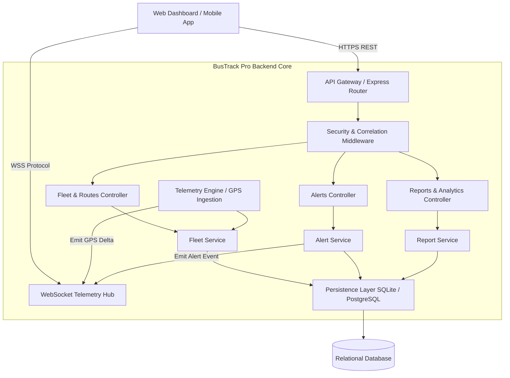

# System Architecture Specification — BusTrack Pro

## 1. High-Level Architecture

- **Architecture Pattern**: Modular Monolith (Domain-Driven Design) with clear migration pathway to Event-Driven Microservices.
- **Communication Pattern**: 
  - **Inbound Client Operations**: RESTful JSON APIs (HTTP/2 ready, RFC 7807 problem details).
  - **Real-Time Telemetry & Notifications**: Full-duplex WebSockets (`/ws/telemetry`) with binary/JSON message frames and heartbeat ping/pong.
  - **Inter-service Communication (Internal)**: In-process EventBus / Domain Event Dispatcher (Kafka/RabbitMQ ready).
- **Data Pattern**: CQRS-lite with write validation models and read-optimized view queries; time-series telemetry append log with retention pruning.
- **Deployment Pattern**: Containerized (Docker, OCI-compliant), multi-stage build, health/readiness probes (`/api/v1/health`), stateless server architecture suitable for horizontal autoscaling behind reverse proxy (Nginx, Traefik, AWS ALB).
- **API Contract**: OpenAPI 3.1.0 specification with strict schema validation.
- **Observability Pattern**: Structured JSON logging, distributed correlation IDs (`X-Correlation-ID`), Prometheus-compatible latency & throughput metrics, SLO monitoring.

---

## 2. Service Decomposition & Domain Model

### Core Domains:
1. **Fleet Management Domain**:
   - Manages physical buses (`buses`), technical specifications, capacity, fuel levels, current status (`active`, `delayed`, `stopped`, `maintenance`).
   - Handles route assignments and driver pairings.
   - Enforces state transition rules (e.g., transition from `active` to `stopped` drops speed to 0 km/h).

2. **Route & Spatial Domain**:
   - Manages transit lines (`routes`), path geometries, sequence of stops (`stops`, `route_stops`), estimated arrival times (ETA), and scheduled travel times.

3. **Driver Domain**:
   - Manages authorized operators (`drivers`), license validation, shift tracking, safety ratings, and trip completions.

4. **Telemetry & Geo-Tracking Domain**:
   - Ingests high-frequency GPS coordinate beacons (x, y coordinates, speed, heading, fuel, passenger load).
   - Feeds real-time consumers through low-latency WebSocket broadcasting with sub-50ms fanout.

5. **Alert & Incident Domain**:
   - Monitors telemetry thresholds (speeding, engine temperature, low fuel < 20%, severe delays, geofence deviation).
   - Generates typed alerts (`critical`, `warning`, `info`) with lifecycle states (`unread`, `read`, `acknowledged`).

6. **Reporting & Analytics Domain**:
   - Computes operational KPIs: fleet utilization rate, passenger volume, average delay minutes, fuel consumption, maintenance frequency.
   - Generates CSV and PDF exports for transport authorities and company management.

---

## 3. Reliability & Resiliency Patterns

1. **Timeout Budgets & Graceful Degradation**:
   - Database query timeout budget set to 2,000ms.
   - If downstream services or disk persistence slow down, read requests return cached snapshots with `Cache-Control: public, max-age=5` and `stale-while-revalidate`.
2. **Circuit Breakers & Rate Limiting**:
   - Token-bucket rate limiter per IP address (120 req/min for general endpoints; 30 req/min for mutating actions).
   - Protection against telemetry packet storms via sliding window deduplication.
3. **Heartbeat & Reconnection Protocol**:
   - WebSocket clients send periodic ping frames every 30 seconds; server terminates dead TCP connections after 2 missed beats.
   - Frontend client implements exponential backoff with jitter (500ms, 1s, 2s, 4s, max 15s) upon connection drop.
4. **Graceful Shutdown**:
   - Catches `SIGTERM` and `SIGINT`:
     - Closes incoming HTTP listeners.
     - Sends WS termination frames to connected clients (`Going Away`).
     - Flushes in-flight telemetry logs to disk/database.
     - Exits cleanly within 5,000ms grace window.

---

## 4. Security & Data Protection

- **Defense in Depth**:
  - Transport Layer Security (TLS 1.3 enforced in production reverse proxy).
  - Security headers enforced: Strict Content-Security-Policy (CSP), `X-Content-Type-Options: nosniff`, `X-Frame-Options: DENY`, `Referrer-Policy: strict-origin-when-cross-origin`.
  - CORS whitelist configured via environment variable `CORS_ORIGIN`.
  - Input validation: strict payload sanitation to prevent SQL injection, prototype pollution, and path traversal.

---

## 5. Observability & SLOs

### Service Level Objectives (SLOs)
| Metric | Objective | Target |
| :--- | :--- | :--- |
| **API Availability** | Uptime excluding scheduled maintenance | `>= 99.9%` |
| **P95 Latency (Read)** | Response time for `GET /api/v1/*` | `< 100 ms` |
| **P99 Latency (Write)** | Response time for `POST / PATCH` | `< 250 ms` |
| **Telemetry Fanout** | Ingestion-to-client WS latency | `< 80 ms` |
| **Error Rate** | 5xx server responses / total requests | `< 0.05%` |

### Telemetry & Tracing
- Structured JSON output to `stdout` compatible with Datadog, ELK, and CloudWatch.
- Unique request tracing header: `X-Correlation-ID` injected at the gateway and propagated across service calls and log entries.
